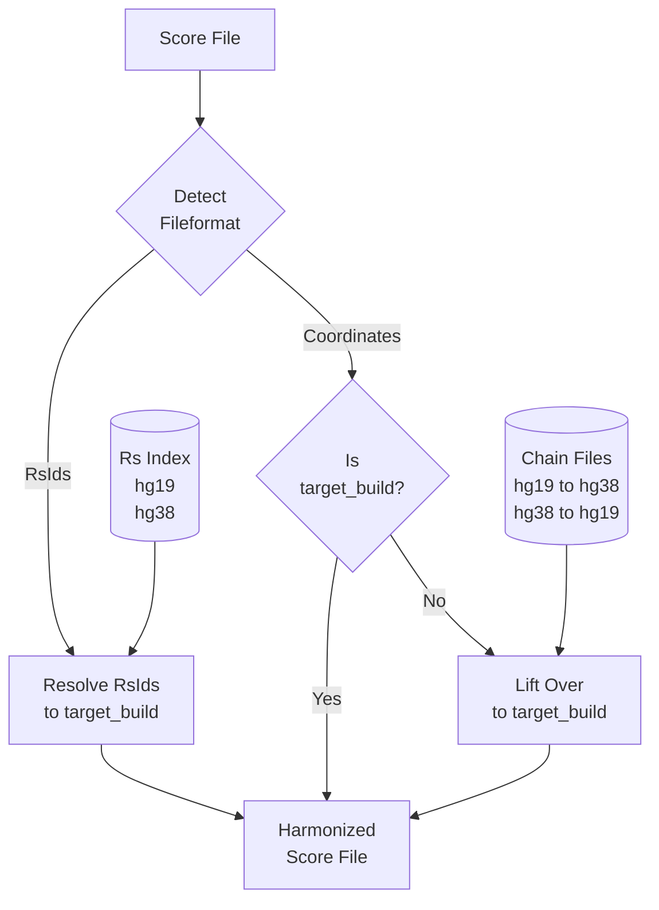

# normalize-pgs-catalog

This Nextflow pipeline downloads all scores from PGS-Catalog and:

- converts all scores with rsIDs to chromosomal position using dbSNP and the provided build
- performs liftover to bring all scores to the same Build
Normalize PGS-Catalog
- tries to detect missing `other_allele` or remove those scores



The resulting files are all on the same build and compatible with [pgs-calc](https://github.com/lukfor/pgs-calc). pgs-calc can also be used to harmonize only one score (see command `resolve`).

## Requirements

- Nextflow:

```
curl -s https://get.nextflow.io | bash
```

- Docker

## Installation

Build docker image before run the pipeline:

```
docker build -t lukfor/normalize-pgs-catalog . # don't ingore the dot here
```

## Step 1: Create dbSNP Index

The following command can be used to create a dbsnp-index file using dbSNP 154 and build hg19:

```
nextflow run dbsnp-index.nf \
  --dbsnp 154 \
  --build hg19 \
  --format tab \
--vcf_url https://resources.pheweb.org/rsids-v154-hg19.tsv.gz \
  --output output/dbsnp-index
```

Pre-calculated dbsnp-index files can be found [here](https://imputationserver.sph.umich.edu/resources/dbsnp-index/). They can be used in [pgs-calc](https://github.com/lukfor/pgs-calc) to resolve rsIDs to chromosomal positions.

## Step 2: Download all scores and replace rsIDs with phyiscal positions

The following command downloads all scores from PGS-Catalog and creates harmonized files for all of them (e.g. build hg19):

```
nextflow run normalize-pgs-catalog.nf \
  --build hg19 \
  --version 20220712 \
  --pgs_catalog_url "https://ftp.ebi.ac.uk/pub/databases/spot/pgs/metadata/pgs_all_metadata.xlsx" \
  --dbsnp_index "output/dbsnp-index/dbsnp154_hg19{.txt.gz,.txt.gz.tbi}" \
  --output output/pgs-catalog-20220712-hg19
```

Pre-calculated files for hg19 and hg38 can be found [here](https://imputationserver.sph.umich.edu/resources/pgs-catalog/).

## Contact

Lukas Forer, Institute of Genetic Epidemiology, Medical University of Innsbruck

## License

This pipeline is MIT Licensed.
